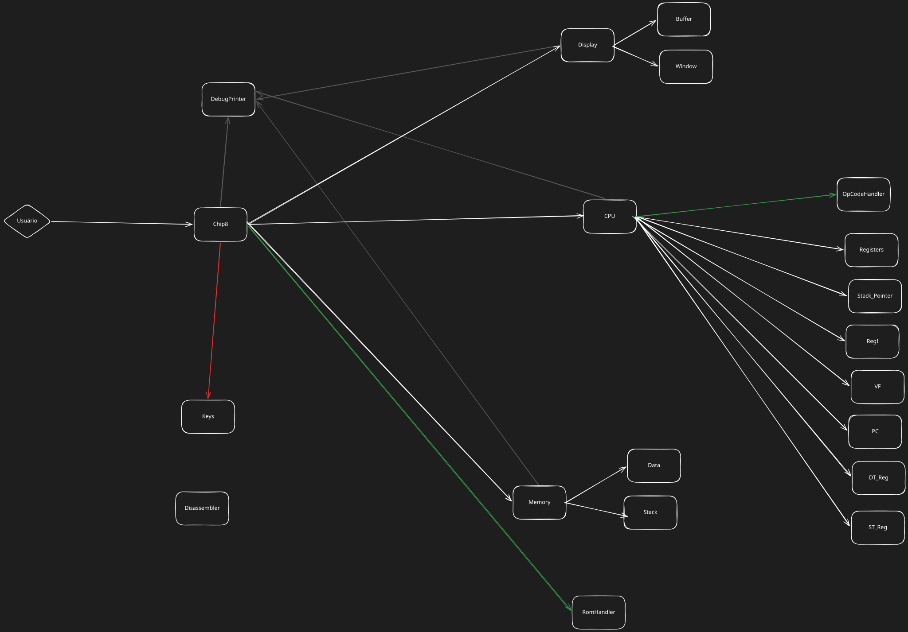

# CHIP 8

## What is This

This is a emulator, or if you prefer, a interpreter for a [Chip 8](https://en.wikipedia.org/wiki/CHIP-8).

## How to Work on It

```bash
git clone git@github.com:Gabriel-Axe/Chip8.git
cd Chip8/src
cargo run
```

The project is based off 2 documents that detail how the Chip 8 works internally:
- [Cowgod Chip 8 Techinical Reference](http://devernay.free.fr/hacks/chip8/C8TECH10.HTM): A overview of the system. Up until the commit 086a33a, the project is based entirely off it.
- [Mattmikolay Techinical Reference](https://github.com/mattmikolay/chip-8/wiki/CHIP%E2%80%908-Technical-Reference): A more detailed explanation on how things works in the machine.

## Architecture



## Project Structure

```txt
.
│
├── Cargo.lock
├── Cargo.toml
├── README.md
│
├── docs
│   │
│   ├── Chip-8-Arcjitecture.excalidraw
│   └── Chip-8-Arcjitecture.svg
│
└── src
    │ 
    ├── chip8.rs
    ├── chip8_tests.rs
    ├── cpu.rs
    ├── debug_printer.rs
    ├── disassembler.rs
    ├── display.rs
    ├── main.rs
    ├── memory.rs
    ├── register.rs
    └── util.rs
```

## Logging

The project has a "static struct" dedicated for structured/consistent logging called DebugPrinter.

It has 3 methods:
- log_state: dedicated for debugging and saying the current state of the emulator
- log_action: dedicated for tracing and showing exact actions being taken at any given moment. Every module of the Chip 8 such as the cpu has a method such as `log_cpu_action` for making it more explicit from where that log was taken from, this redundant with the default Rust logging behavior, but it's faster to read the latter part of the log then scan the whole log line.
- log_info: dedicated towards important (and possibly user facing) information, such as `rom loaded` and `error: stack overflow`.
